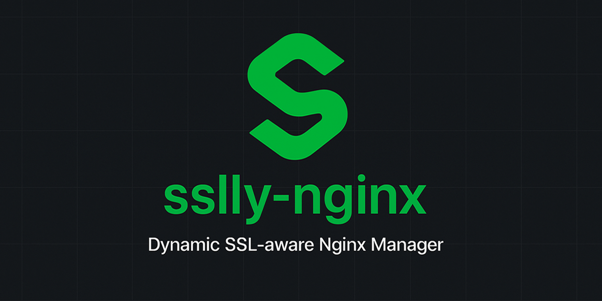

# sslly-nginx

A smart Nginx SSL reverse proxy manager that automatically configures SSL certificates and proxies traffic to your local applications.



## Features

- 🔄 **Automatic Configuration**: Watches for configuration and SSL certificate changes and automatically reloads Nginx
- 🔒 **SSL Management**: Automatically scans and maps SSL certificates to domains
- 🔁 **Hot Reload**: Updates Nginx configuration without downtime when files change
- 🛡️ **Error Recovery**: Maintains the last working configuration and rolls back on failures
- 🐳 **Docker Ready**: Runs as a containerized service with Docker Compose
- 🌐 **FRP Integration**: Easy integration with FRP for secure remote access to local services
- 🚀 **CI/CD Pipeline**: Includes GitHub Actions workflows for testing, building, and releasing

## How It Works

`sslly-nginx` is a Go application that runs inside an Nginx Alpine container and manages the Nginx configuration dynamically:

1. **Configuration Monitoring**: Watches `./configs/config.yaml` for changes
2. **Certificate Scanning**: Recursively scans `./ssl` directory for certificate files
3. **Nginx Generation**: Generates Nginx configuration based on port-to-domain mappings
4. **Health Checks**: Verifies Nginx health after each reload
5. **Rollback Protection**: Maintains last working configuration for automatic recovery

## Quick Start

For a quick start & deployment guide, see [docs/QUICKSTART.md](docs/QUICKSTART.md).

## Documentation

- [Quick Start Guide](docs/QUICKSTART.md) - Get started with installation and deployment
- [CORS Configuration](docs/CORS.md) - Comprehensive CORS setup and best practices
- [FRP Integration](docs/FRP.md) - Set up FRP for remote access to local services

## Configuration

### Application Configuration

The configuration file (`configs/config.yaml`) maps upstream addresses to domain names. It supports multiple formats and advanced features.

#### CORS Configuration (Optional)

Configure CORS (Cross-Origin Resource Sharing) settings globally or per-domain.

```yaml
# You can also configure CORS for specific domains:
cors:
  'api.example.com':
    allow_origin: 'https://app.example.com'
    allow_methods: [GET, POST, PUT, DELETE, OPTIONS]
    allow_headers: [Content-Type, Authorization]
    allow_credentials: true
```

For more please check [CORS Configuration](docs/CORS.md) for comprehensive CORS setup guide and best practices examples

#### Basic Port Mapping Formats

##### Format 1: Port Only (Default to localhost)

```yaml
# Proxies to 127.0.0.1:port
1234:
  - example.com
  - www.example.com
5678:
  - api.example.com
```

##### Format 2: IP:Port (Proxy to specific IP)

```yaml
# Proxies to 192.168.31.6:1234
192.168.31.6:1234:
  - lan.example.com
  - local.example.com
```

##### Format 3: Hostname:Port

```yaml
# Proxies to example-server.local:8080
example-server.local:8080:
  - remote.example.com
```

##### Format 4: IPv6 with Brackets

```yaml
# Proxies to IPv6 address 2001:db8::1 port 3000
'[2001:db8::1]:3000':
  - ipv6.example.com
```

##### Format 5: HTTPS Backend (Use `[https]` prefix)

```yaml
# Proxies to HTTPS backend (prevents "plain HTTP to HTTPS port" errors)
'[https]192.168.50.2:8443':
  - secure-backend.example.com
```

**Note:** By default, sslly-nginx forwards requests to upstream servers using HTTP. Use the `[https]` prefix when your upstream server expects HTTPS connections to avoid "400 Bad Request - The plain HTTP request was sent to HTTPS port" errors.

#### Advanced: Path-based Routing

Route different paths of the same domain to different backends:

```yaml
# Main site on port 9012
9012:
  - shared.example.com

# API endpoints on different server
192.168.50.2:5678/api:
  - shared.example.com/api
```

This generates Nginx configuration with location-based routing:

- `shared.example.com/api` → `192.168.50.2:5678/api`
- `shared.example.com/` → `127.0.0.1:9012`

**Configuration Key Formats Summary:**

- `port` → Proxies to `127.0.0.1:port` via HTTP (default)
- `ip:port` → Proxies to `ip:port` via HTTP
- `hostname:port` → Proxies to `hostname:port` via HTTP
- `[ipv6]:port` → Proxies to IPv6 address with brackets via HTTP
- `[https]upstream` → Proxies to upstream via HTTPS (prevents "plain HTTP to HTTPS port" errors)
  - Example: `[https]192.168.50.2:8443` forwards requests using HTTPS
- `upstream/path` → Adds path routing to the upstream
  - Example: `192.168.50.2:5678/api` proxies `/api` requests to that backend

### SSL Certificate Structure

Place SSL certificates in the `ssl/` directory. The application supports the following naming patterns:

1. **Bundle format**: `domain_bundle.crt` and `domain_bundle.key`

   - Example: `example.com_bundle.crt` and `example.com_bundle.key`

2. **Standard format**: `domain.crt` and `domain.key`
   - Example: `example.com.crt` and `example.com.key`

You can organize certificates in subdirectories:

```tree
ssl/
├── production/
│   ├── example.com_bundle.crt
│   └── example.com_bundle.key
├── staging/
│   ├── staging.example.com.crt
│   └── staging.example.com.key
└── api.example.com.crt
    └── api.example.com.key
```

**Important Notes**:

- Each domain must have exactly one certificate (no duplicates)
- Both `.crt` and `.key` files must exist
- Certificates are matched by domain name automatically
- **SSL certificates are optional**: If no certificate is found for a domain, the service will proxy HTTP traffic directly
- **HTTPS to HTTP redirect**: If HTTPS is accessed for domains without valid certificates, traffic is redirected to HTTP (301)

### HTTP-Only Mode

If you don't have SSL certificates yet or want to serve some domains over HTTP only:

1. The application will automatically detect missing certificates
2. Domains without certificates will be served over HTTP (no redirect)
3. Domains with certificates will use HTTPS with automatic HTTP → HTTPS redirect
4. **HTTPS fallback**: If someone accesses HTTPS for a domain without a valid certificate, they'll be redirected to HTTP with a 301 status
5. You can mix HTTP and HTTPS domains in the same configuration

Example scenario:

```yaml
# config.yaml
1234:
  - secure.example.com # Has certificate → HTTPS
  - dev.example.com # No certificate → HTTP only
```

## Features in Detail

### Automatic HTTPS Redirect

When SSL certificates are detected:

- All HTTP traffic for domains **with certificates** is automatically redirected to HTTPS
- HTTPS traffic for domains **without certificates** is redirected to HTTP (301) to avoid certificate errors

If no certificates are found for any domain, HTTP traffic is proxied directly to your applications.

### Hot Reload

The application watches for changes in:

- Configuration files (`./configs/config.yaml` or `./configs/config.yml`)
- SSL certificates (`./ssl/**/*`)

When changes are detected:

1. New configuration is generated
2. Nginx configuration is tested
3. If valid, Nginx is reloaded
4. If invalid, the previous working configuration is restored

### Error Handling

- **Initial Startup**:
  - If configuration is invalid, the service stops
  - Missing SSL certificates are **not** an error - service runs in HTTP-only mode
- **Runtime Errors**: If reload fails, the application:
  - Logs detailed error messages
  - Restores the last working configuration
  - Continues running with previous settings

### WebSocket Support

The generated Nginx configuration includes WebSocket support for all proxied applications.

### Advanced Proxy Features

The reverse proxy includes optimized settings for various applications:

- **Large File Upload**: Supports files up to 100MB by default
- **Correct Host Header**: Uses `$host` to preserve the original request hostname (critical for apps like qBittorrent, OnlineJudge)
- **Proxy Headers**: Includes all standard headers:
  - `Host`: Original request hostname (e.g., `torrent.hnrobert.space`)
  - `X-Real-IP`: Client's real IP address
  - `X-Forwarded-For`: Full proxy chain
  - `X-Forwarded-Host`: Original Host header
  - `X-Forwarded-Proto`: Original protocol (http/https)
- **Cookie Security**: Automatically sets Secure flag for cookies when using HTTPS
- **Timeouts**: Configured with 60s timeouts for connect/send/read operations
- **Proxy Buffering**: Optimized buffer settings for better performance

These settings work well with applications like:

- qBittorrent (WebUI)
- Portainer (Docker management)
- Jellyfin (Media streaming)
- Home Assistant (Smart home)
- OnlineJudge (Competitive programming)
- And most other web applications

## FRP Integration

`sslly-nginx` integrates seamlessly with [FRP (Fast Reverse Proxy)](https://github.com/fatedier/frp) to expose your local services through remote servers, enabling secure remote access to your applications from anywhere.

### Key Benefits

- **Secure Remote Access**: Access your local applications from anywhere via HTTPS
- **Custom Domains**: Use your own domain names instead of IP addresses
- **SSL Management**: SSL certificates configured locally for domain-based routing
- **Flexible Port Configuration**: Change HTTP/HTTPS ports to avoid conflicts with FRP

### Quick Setup

1. **Configure Ports**: Modify `docker-compose.yml` to use non-standard ports:

   ```yaml
   environment:
     - SSL_NGINX_HTTP_PORT=9980 # HTTP traffic
     - SSL_NGINX_HTTPS_PORT=9943 # HTTPS traffic
   ```

2. **Setup FRP Client**: Create `frpc.toml`:

   ```toml
   serverAddr = "your-frp-server.com"
   serverPort = 7000
   auth.method = "token"
   auth.token = "your-secure-token"

   # HTTPS proxy - handles SSL/TLS traffic
   [[proxies]]
   name = "sslly-nginx-https"
   type = "https"
   localIP = "127.0.0.1"
   localPort = 9943
   customDomains = ["*.yourdomain.com", "yourdomain.com"]

   # HTTP proxy - handles plain HTTP and auto-redirects
   [[proxies]]
   name = "sslly-nginx-http"
   type = "http"
   localIP = "127.0.0.1"
   localPort = 9980
   customDomains = ["*.yourdomain.com", "yourdomain.com"]
   ```

3. **Start Services**: Run both FRP client and sslly-nginx

For detailed FRP integration guide, see [docs/FRP.md](docs/FRP.md).

## Development

### Build Locally

```bash
# Build the binary
make build

# Run tests
make test

# Run tests with coverage
make test-coverage

# Format code
make fmt

# Run linter
make lint
```

### Build Docker Image

```bash
# Build image
make docker-build

# Or use Docker directly
docker build -t sslly-nginx:latest .
```

### Run Locally (without Docker)

```bash
# Note: Requires Nginx installed on your system
make run
```

## CI/CD Workflows

The project includes three GitHub Actions workflows:

### 1. CI Workflow (`ci.yml`)

- **Triggers**: All branch pushes and pull requests
- **Actions**:
  - Build the application
  - Run tests
  - Run linter and format checks
- **No Docker image is built**

### 2. Docker Build Workflow (`docker-build.yml`)

- **Triggers**: Pushes to `main` and `develop` branches
- **Actions**:
  - Run tests
  - Build Docker image
  - Push to `ghcr.io`
- **Tags**:
  - `main` branch → `latest` tag
  - `develop` branch → `develop` tag

### 3. Release Workflow (`release.yml`)

- **Triggers**:
  - Git tag push (e.g., `v1.0.0`)
  - Manual workflow dispatch
- **Actions**:
  - Create tag (if workflow_dispatch)
  - Run tests
  - Build and push Docker image with version tag
  - Create GitHub release

## Docker Compose Configuration

The `docker-compose.yml` is configured with:

- **Network Mode**: `host` - Uses host networking for direct port access
- **Restart Policy**: `on-failure` - Stops on errors, auto-starts on system boot
- **Volumes**:
  - `./configs:/app/configs:ro` - Configuration (read-only)
  - `./ssl:/app/ssl:ro` - SSL certificates (read-only)

### Environment Variables

- `SSL_NGINX_HTTP_PORT` (default: `80`) — port Nginx listens for HTTP and redirect to HTTPS
- `SSL_NGINX_HTTPS_PORT` (default: `443`) — port Nginx listens for HTTPS

### Viewing Logs

All logs (application + nginx access/error logs) are forwarded to Docker's log collector:

```bash
# View all logs
docker-compose logs -f

# View only application logs
docker-compose logs -f sslly-nginx

# View last 100 lines
docker-compose logs --tail=100 sslly-nginx
```

Nginx access and error logs are automatically forwarded to stdout/stderr and visible via `docker logs`

## Project Structure

```tree
sslly-nginx/
├── cmd/
│   └── sslly-nginx/
│       └── main.go              # Application entry point
├── internal/
│   ├── app/
│   │   └── app.go               # Application logic
│   ├── config/
│   │   ├── config.go            # Configuration loader
│   │   └── config_test.go
│   ├── nginx/
│   │   └── nginx.go             # Nginx management
│   ├── ssl/
│   │   ├── ssl.go               # Certificate scanner
│   │   └── ssl_test.go
│   └── watcher/
│       └── watcher.go           # File system watcher
├── .github/
│   └── workflows/
│       ├── ci.yml               # CI pipeline
│       ├── docker-build.yml     # Docker build pipeline
│       └── release.yml          # Release pipeline
├── configs/
│   └── config.example.yaml      # Example configuration
├── ssl/
│   └── README.md                # SSL certificate guide
├── Dockerfile                   # Docker image definition
├── docker-compose.yml           # Docker Compose configuration
├── Makefile                     # Build automation
├── go.mod                       # Go module definition
└── README.md                    # This file
```

## Logging

The application logs important events:

- Configuration changes detected
- Certificate scanning results
- Nginx reload success/failure
- Error details with recovery actions

Logs can be viewed with:

```bash
docker-compose logs -f
```

## Troubleshooting

### Container Stops Immediately

**Cause**: Invalid configuration or missing certificates

**Solution**:

1. Check logs: `docker-compose logs`
2. Verify `configs/config.yaml` exists and is valid YAML
3. Ensure all domains have matching certificates in `ssl/`

### Certificate Not Found

**Cause**: Certificate file naming doesn't match expected patterns

**Solution**:

1. Check certificate files follow naming pattern: `domain.crt/key` or `domain_bundle.crt/key`
2. Ensure both `.crt` and `.key` files exist
3. Check logs for certificate scanning results

### Nginx Fails to Reload

**Cause**: Configuration error or certificate issues

**Solution**:

1. Application automatically rolls back to last working configuration
2. Check logs for specific error messages
3. Fix the configuration or certificate issue
4. Changes will be automatically detected and reloaded

## Contributing

Contributions are welcome! Please feel free to submit a Pull Request.

## License

See [LICENSE](LICENSE) file for details.

## Support

For issues and questions, please use the [GitHub Issues](https://github.com/hnrobert/sslly-nginx/issues) page.
A nginx container with automatic ssl handling
