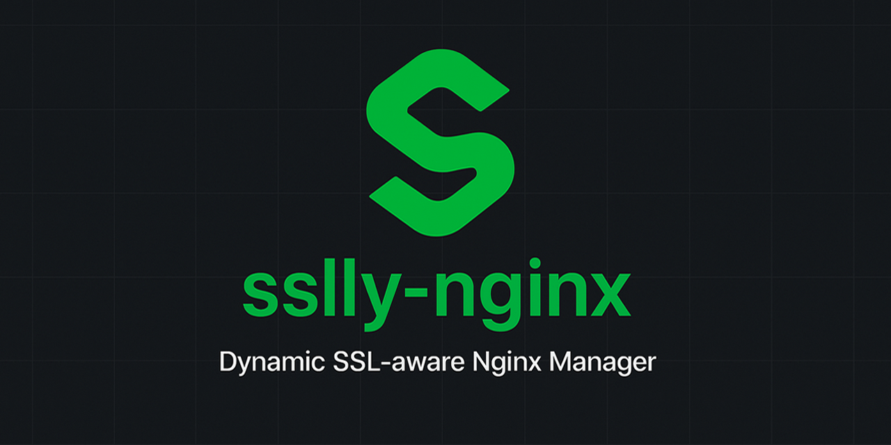

# sslly-nginx

A smart Nginx SSL reverse proxy manager that automatically configures SSL certificates and proxies traffic to your local applications.

> I HATE writing Nginx config, that's why this project was born.

Just tell this tool the port and domain, and I handle the rest.

<p align="right"><strong>Robert He</strong></p>



## Features

- **Simple Rules**: Just map port to domains in a YAML file, no more Nginx config writing
- **Automatic Configuration**: Watches for configuration and SSL certificate change, automatically reloads Nginx
- **SSL Management**: Automatically scans and maps SSL certificates to domains
- **Hot Reload**: Updates Nginx configuration without downtime when files change
- **Error Recovery**: Maintains the last working configuration and rolls back on failures
- **Docker Ready**: Runs as a containerized service with Docker Compose
- **FRP Friendly**: Easy integration with FRP for secure remote access to local services

### Supported Features

- [x] HTTP and HTTPS proxying
- [x] Automatic HTTP → HTTPS redirection for domains with valid certificates
- [x] TCP and UDP stream forwarding
- [x] CORS configuration (optional)
- [x] Custom log levels and formats (optional)
- [x] WebSocket support
- [x] Static site hosting

## Quick Start

### One-Command Setup

```bash
# Set up working directory
export SSLLY_NGINX_HOME=$HOME/sslly-nginx
mkdir -p $SSLLY_NGINX_HOME && cd $SSLLY_NGINX_HOME

# Download Docker Compose configuration
curl -fsSL https://raw.githubusercontent.com/hnrobert/sslly-nginx/main/docker-compose.yml -o docker-compose.yml

# Start the service
docker-compose up -d
```

The service will start with default configuration and create `configs/` and `ssl/` directories.

### Customize Configuration

Edit `configs/proxy.yaml` to add your routes:

```bash
# View logs
docker-compose logs -f

# Stop service
docker-compose down
```

### Add SSL Certificates

Drop certificate files into the `ssl/` directory:

```text
ssl/
├── example.com.crt
├── example.com.key
└── api.example.com_bundle.crt
```

## Documentation

- [Configuration Reference](docs/CONFIG_REFERENCE.md) - Complete configuration format and rules
- [CORS Configuration](docs/CORS.md) - Comprehensive CORS setup and best practices
- [FRP Integration](docs/FRP.md) - Set up FRP for remote access to local services

## Configuration

### Configuration Format Summary

```yaml
upstream_key:
  - listener_key_1
  - listener_key_2
```

### upstream_key Format

```md
<upstream_protocol>domain:port/routes
```

or for static sites:

```md
static_route//additional/routes
```

| Component | Required | Default | Description |
|-----------|----------|---------|-------------|
| `upstream_protocol` | No | `http` | `https`, `tcp`, `udp` (omit for `http`) |
| `domain` | No | `127.0.0.1` | IP or hostname (IPv6: `[::1]`) |
| `port` | No | Protocol default | Port number |
| `routes` | No | - | URL path routing |
| `static_route` | - | - | Path representing www root location in filesystem starting with `/` or `.` or `..` (`.` = `/app`) |

### listener_key Format

```md
<listen_protocol>listened_server_name|listened_port
```

| Component | Required | Default | Description |
|-----------|----------|---------|-------------|
| `listen_protocol` | No | Smart mode | `http`, `https`, `tcp`, `udp` |
| `listened_server_name` | No | All interfaces | Server name (domain) |
| `listened_port` | No | Env var ports | Listen port |

### Quick Examples

```yaml
# HTTP proxy to localhost:8080
8080:
  - example.com

# HTTPS upstream
<https>api.secure.com:
  - example.com

# TCP forwarding
<tcp>9122:
  - 8122

# Static site (relative path, . = /app)
./static:
  - static.example.com

# Static site (parent path, .. = /)
../data:
  - data.example.com

# Static with route path (using //)
/app/static//docs:
  - docs.example.com
```

For complete format specification and advanced examples, see [Configuration Reference](docs/CONFIG_REFERENCE.md).

### Optional Configuration Files

#### CORS Configuration

Configure CORS (Cross-Origin Resource Sharing) settings globally or per-domain.

```yaml
api.example.com:
  allow_origin: 'https://app.example.com'
  allow_methods: [GET, POST, PUT, DELETE, OPTIONS]
  allow_headers: [Content-Type, Authorization]
  allow_credentials: true
```

For more please check [CORS Configuration](docs/CORS.md) for comprehensive CORS setup guide and best practices examples.

### SSL Certificate Structure

Place SSL certificates in the `ssl/` directory. The application automatically matches certificate files (`.crt`) with their corresponding private key files (`.key`) based on the domain information contained within the SSL certificates themselves.

```bash
ssl/
├── production/
│   ├── example.com_bundle.crt
│   └── example.com_bundle.key
├── staging/
│   ├── staging.example.com.crt
│   └── staging.example.com.key
└── api.example.com.crt
    └── api.example.com.key
```

**Important Notes**:

- Duplicate certificates are allowed for each domain, If multiple pairs of certificate+key are found, the farthest expiration time is selected.
- Certificate and key files are optional (a domain without a matched cert/key will be served over HTTP)
- **SSL certificates are optional**: If no certificate is found for a domain, the service will proxy HTTP traffic directly to your applications
- **HTTPS to HTTP redirect**: If HTTPS is accessed for domains without valid certificates, traffic is redirected to HTTP (301)

### Backup & Crash Recovery

To make hot-reloads safer, `sslly-nginx` keeps a persistent on-disk snapshot of the last known-good configuration.

- Backup folder: `configs/.sslly-backups/`
- Snapshot content: `configs/` + `ssl/` + generated `/etc/nginx/nginx.conf`
- Runtime cache: The currently used cert/key files are copied into `configs/.sslly-runtime/current/` and nginx.conf only references that cache, so edits under `ssl/` won't affect the running nginx process until a successful reload.

Crash detection: If the previous run died mid-reload, the next start detects the unfinished reload and automatically restores the last known-good snapshot.

### HTTP-Only Mode

If you don't have SSL certificates yet but want to serve some domains over HTTP only:

1. The application will automatically detect missing certificates
2. Domains without certificates will be served over HTTP (no redirect)
3. Domains with certificates will use HTTPS with automatic HTTP → HTTPS redirect
4. **HTTPS fallback**: If someone accesses HTTPS for a domain without a valid certificate, they'll be redirected to HTTP with a 301 status
5. You can mix HTTP and HTTPS domains in the same configuration

Example scenario:

```yaml
# proxy.yaml
1234:
  - secure.example.com # Has certificate → HTTPS
  - dev.example.com # No certificate → HTTP only
```

## Features in Detail

### Automatic HTTPS Redirect

When SSL certificates are detected:

- All HTTP traffic for domains **with certificates** is automatically redirected to HTTPS
- HTTPS traffic for domains **without certificates** is redirected to HTTP (301) to avoid certificate errors
- If no certificates are found for any domain, HTTP traffic is proxied directly to your applications

### Hot Reload

The application watches for changes in:

- Configuration files (`./configs/proxy.yaml`, optional `./configs/cors.yaml`, `./configs/logs.yaml`)
- SSL certificates (`./ssl/**/*`)

Note: internal state folders under `configs/` (like `configs/.sslly-backups/` and `configs/.sslly-runtime/`) are ignored by the watcher to avoid feedback loops.

When changes are detected:

1. New configuration is generated
2. Nginx configuration is tested
3. If valid, Nginx is reloaded
4. If invalid, the previous working configuration is restored (including on-disk `configs/` + `ssl/` contents)

### Logs: Domain Summary

On startup and after every successful reload, the service prints a single domain summary instead of logging domain status one-by-one:

- `Matched:` (INFO) domains with a valid certificate+key pair (labeled "SSL")
- `No-cert:` (WARN) domains with no matched certificate+key (served over HTTP)
- `Expired:` (WARN) domains with a matched certificate+key but the certificate is expired
- `Multi-certs:` (WARN) domains where multiple certificate candidates were found; the selected cert path is shown along with the ignored count.

### Error Handling

- **Initial Startup**:
  - If configuration is invalid, the service stops
  - Missing SSL certificates are **not** an error - service runs in HTTP-only mode
- **Runtime Errors**: If reload fails, the application:
  - Logs detailed error messages
  - Restores the last working configuration
  - Continues running with previous settings

## Testing

Run unit tests:

```bash
go test ./...
```

Run tests with coverage:

```bash
go test ./... -coverprofile=coverage.out
go tool cover -func=coverage.out
go tool cover -html=coverage.out -o coverage.html
```

### WebSocket Support

The generated Nginx configuration includes WebSocket support for all proxied applications.

### Advanced Proxy Features

The reverse proxy includes optimized settings for various applications:

- **Large File Upload**: Supports files up to 100MB by default
- **Correct Host Header**: Uses `$host` to preserve the original request hostname (critical for apps like qBittorrent, OnlineJudge)
- **Proxy Headers**: Includes all standard headers:
  - `Host`: Original request hostname (e.g., `torrent.hnrobert.space`)
  - `X-Real-IP`: Client's real IP address
  - `X-Forwarded-For`: Full proxy chain
  - `X-Forwarded-Host`: Original Host header
  - `X-Forwarded-Proto`: Original protocol (http/https)
- **Cookie Security**: Automatically sets Secure flag for cookies when using HTTPS
- **Timeouts**: Configured with 60s timeouts for connect/send/read operations
- **Proxy Buffering**: Optimized buffer settings for better performance

These settings work well with applications like:

- qBittorrent (WebUI)
- Portainer (Docker management)
- Jellyfin (Media streaming)
- Home Assistant (Smart home)
- OnlineJudge (Competitive programming)
- And most other web applications

## FRP Integration

`sslly-nginx` integrates seamlessly with [FRP (Fast Reverse Proxy)](https://github.com/fatedier/frp) to expose your local services through remote servers, enabling secure remote access to your applications from anywhere.

### Key Benefits

- **Secure Remote Access**: Access your local applications from anywhere via HTTPS
- **Custom Domains**: Use your own domain names instead of IP addresses
- **SSL Management**: SSL certificates configured locally for domain-based routing
- **Flexible Port Configuration**: Change HTTP/HTTPS ports to avoid conflicts with FRP

### Quick Setup

1. **Configure Ports**: Modify `docker-compose.yml` to use non-standard ports:

   ```yaml
   environment:
     - SSLLY_DEFAULT_HTTP_LISTEN_PORT=9980 # HTTP traffic
     - SSLLY_DEFAULT_HTTPS_LISTEN_PORT=9943 # HTTPS traffic
   ```

   > **Note:** The legacy environment variables `SSL_NGINX_HTTP_PORT` and `SSL_NGINX_HTTPS_PORT` are also supported for backward compatibility.

2. **Setup FRP Client**: Create `frpc.toml`:

   ```toml
   serverAddr = "your-frp-server.com"
   serverPort = 7000
   auth.method = "token"
   auth.token = "your-secure-token"

   # HTTPS proxy - handles SSL/TLS traffic
   [[proxies]]
   name = "sslly-nginx-https"
   type = "https"
   localIP = "127.0.0.1"
   localPort = 9943
   customDomains = ["*.yourdomain.com", "yourdomain.com"]

   # HTTP proxy - handles plain HTTP and auto-redirects
   [[proxies]]
   name = "sslly-nginx-http"
   type = "http"
   localIP = "127.0.0.1"
   localPort = 9980
   customDomains = ["*.yourdomain.com", "yourdomain.com"]
   ```

3. **Start Services**: Run both FRP client and sslly-nginx

For detailed FRP integration guide, see [docs/FRP.md](docs/FRP.md).

## Development

### Build Locally

```bash
# Build the binary
make build

# Run tests
make test

# Run tests with coverage
make test-coverage

# Format code
make fmt

# Run linter
make lint
```

### Build Docker Image

```bash
# Build image
make docker-build

# Or use Docker directly
docker build -t sslly-nginx:latest .
```

### Run Locally (without Docker)

```bash
# Note: Requires Nginx installed on your system
make run
```

## CI/CD Workflows

The project includes three GitHub Actions workflows:

### 1. CI Workflow (`ci.yml`)

- **Triggers**: All branch pushes and pull requests
- **Actions**:
  - Build the application
  - Run tests
  - Run linter and format checks
- **No Docker image is built**

### 2. Docker Build Workflow (`docker-build.yml`)

- **Triggers**: Pushes to `main` and `develop` branches
- **Actions**:
  - Run tests
  - Build Docker image
  - Push to `ghcr.io`
- **Tags**:
  - `main` branch → `latest` tag
  - `develop` branch → `develop` tag

### 3. Release Workflow (`release.yml`)

- **Triggers**:
  - Git tag push (e.g., `v1.0.0`)
  - Manual workflow dispatch
- **Actions**:
  - Create tag (if workflow_dispatch)
  - Run tests
  - Build and push Docker image with version tag
  - Create GitHub release

## Docker Compose Configuration

The `docker-compose.yml` is configured with:

- **Network Mode**: `host` - Uses host networking for direct port access
- **Restart Policy**: `on-failure` - Stops on errors, auto-starts on system boot
- **Volumes**:
  - `./configs:/app/configs:ro` - Configuration (read-only)
  - `./ssl:/app/ssl:ro` - SSL certificates (read-only)

### Environment Variables

- `SSLLY_DEFAULT_HTTP_LISTEN_PORT` (default: `80`) — port Nginx listens for HTTP and redirect to HTTPS
- `SSLLY_DEFAULT_HTTPS_LISTEN_PORT` (default: `443`) — port Nginx listens for HTTPS

> **Note:** The legacy environment variables `SSL_NGINX_HTTP_PORT` and `SSL_NGINX_HTTPS_PORT` are still supported for backward compatibility but are deprecated.

### Viewing Logs

All logs (application + nginx access/error logs) are forwarded to Docker's log collector:

```bash
# View all logs
docker-compose logs -f

# View only application logs
docker-compose logs -f sslly-nginx

# View last 100 lines
docker-compose logs --tail=100 sslly-nginx
```

Nginx access and error logs are automatically forwarded to stdout/stderr and visible via `docker logs`

## Project Structure

```bash
sslly-nginx/
├── cmd/
│   └── sslly-nginx/
│       └── main.go              # Application entry point
├── internal/
│   ├── app/
│   │   └── app.go               # Application logic
│   ├── config/
│   │   ├── config.go            # Configuration loader
│   │   └── config_test.go
│   ├── nginx/
│   │   └── nginx.go             # Nginx management
│   ├── ssl/
│   │   ├── ssl.go               # Certificate scanner
│   │   └── ssl_test.go
│   └── watcher/
│       └── watcher.go           # File system watcher
├── .github/
│   └── workflows/
│       ├── ci.yml               # CI pipeline
│       ├── docker-build.yml     # Docker build pipeline
│       └── release.yml          # Release pipeline
├── configs/
│   ├── proxy.yaml               # Proxy mappings (required)
│   ├── cors.yaml                # Optional CORS settings
│   ├── logs.yaml                # Optional log settings
│   ├── proxy.example.yaml       # Example proxy mappings
│   ├── cors.example.yaml        # Example CORS settings
│   └── logs.example.yaml        # Example log settings
├── ssl/
│   └── README.md                # SSL certificate guide
├── Dockerfile                   # Docker image definition
├── docker-compose.yml           # Docker Compose configuration
├── Makefile                     # Build automation
├── go.mod                       # Go module definition
└── README.md                    # This file
```

## Logging

The application logs important events:

- Configuration changes detected
- Certificate scanning results
- Nginx reload success/failure
- Error details with recovery actions

Logs can be viewed with:

```bash
docker-compose logs -f
```

## Troubleshooting

### Container Stops Immediately

**Cause**: Invalid configuration or missing certificates

**Solution**:

1. Check logs: `docker-compose logs`
2. Verify `configs/proxy.yaml` exists and is valid YAML
3. Ensure all domains have matching certificates in `ssl/`

### Certificate Not Found

**Cause**: Certificate file naming doesn't match expected patterns

**Solution**:

1. Check certificate files follow naming pattern: `domain.crt/key` or `domain_bundle.crt/key`
2. Ensure both `.crt` and `.key` files exist
3. Check logs for certificate scanning results

### Nginx Fails to Reload

**Cause**: Configuration error or certificate issues

**Solution**:

1. Application automatically rolls back to last working configuration
2. Check logs for specific error messages
3. Fix the configuration or certificate issue
4. Changes will be automatically detected and reloaded

## Contributing

Contributions are welcome! Please feel free to submit a Pull Request.

## License

See [LICENSE](LICENSE) file for details.

## Support

For issues and questions, please use the [GitHub Issues](https://github.com/hnrobert/sslly-nginx/issues) page.
