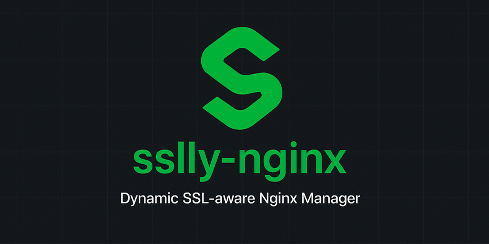

# sslly-nginx

A smart Nginx SSL reverse proxy manager that automatically configures SSL certificates and proxies traffic to your local applications.

> I HATE writing Nginx config, that's why this project was born.
> Just tell this tool the port and domain, and let it handle the rest.

<!-- markdownlint-disable-next-line MD033 -->
> <p align="right"><strong>Robert He</strong></p>



## Features

- **Simple Rules**: Just map port to domains in a YAML file, no more Nginx config writing
- **Automatic Configuration**: Watches for configuration and SSL certificate change, automatically reloads Nginx
- **SSL Management**: Automatically scans and maps SSL certificates to domains
- **Hot Reload**: Updates Nginx configuration without downtime when files change
- **Error Recovery**: Maintains the last working configuration and rolls back on failures
- **Web Control API**: gRPC + HTTP/JSON API with multi-user RBAC to manage everything remotely
- **Docker Ready**: Runs as a containerized service with Docker Compose
- **FRP Friendly**: Easy integration with FRP for secure remote access to local services

### Supported Features

- [x] HTTP and HTTPS proxying
- [x] Automatic HTTP → HTTPS redirection for domains with valid certificates
- [x] TCP and UDP stream forwarding
- [x] Static site hosting
- [x] WebSocket support
- [x] CORS configuration (optional)
- [x] Custom log levels and formats (optional)
- [x] Web control API with per-user read/write scopes
- [x] Generated client SDKs for Go / TypeScript / Python / .NET

## Quick Start

### One-Command Setup

```bash
# Set up working directory
export SSLLY_NGINX_HOME=$HOME/sslly-nginx
mkdir -p $SSLLY_NGINX_HOME && cd $SSLLY_NGINX_HOME

# Download Docker Compose configuration
curl -fsSL https://raw.githubusercontent.com/hnrobert/sslly-nginx/main/docker-compose.yml -o docker-compose.yml

# Start the service
docker-compose up -d
```

The service will start with default configuration and create `configs/` and `ssl/` directories.

### Add Your First Route

Edit `configs/proxy.yaml` — map an upstream to the domains that route to it:

```yaml
# proxy traffic for example.com to localhost:8080
8080:
  - example.com
```

The watcher picks the change up within a second and hot-reloads nginx (with validation and automatic rollback).

```bash
# View logs
docker-compose logs -f

# Stop service
docker-compose down
```

### Add SSL Certificates

Drop certificate files into the `ssl/` directory — the app matches `.crt`/`.key` pairs by the domains inside the certificates, not by filename:

```bash
ssl/
├── example.com.crt
├── example.com.key
└── api.example.com_bundle.crt
```

## Documentation

| Doc | Contents |
| --- | --- |
| [Configuration Reference](docs/CONFIG_REFERENCE.md) | Complete `proxy.yaml` format, keys, validation rules, env vars |
| [CORS Configuration](docs/CORS.md) | CORS rules, wildcard matching, inheritance & clearing |
| [Control API Reference](docs/API.md) | Endpoints, auth, RBAC semantics, mutation pipeline |
| [Client SDKs](docs/SDK.md) | Install & use the generated Go/TS/Python/.NET SDKs |
| [Manual nginx Edits](docs/MANUAL_NGINX_EDIT.md) | Safely hand-edit the generated nginx.conf |
| [FRP Integration](docs/FRP.md) | Expose local services through an FRP server |

## Configuration

### Format Summary

```yaml
upstream_key:
  - listener_key_1
  - listener_key_2
```

An `upstream_key` names the backend (`8080`, `192.168.50.2:1234`, `<https>host:8443`,
`<tcp>9122`, or a static-site directory); `listener_key` entries name what
routes to it (`example.com`, `example.com/api`, `example.com|8443`,
`<http>example.com`). The full grammar and defaults live in the
[Configuration Reference](docs/CONFIG_REFERENCE.md).

### Quick Examples

```yaml
# HTTP proxy to localhost:8080
8080:
  - example.com

# HTTPS upstream
<https>api.secure.com:
  - example.com

# TCP forwarding
<tcp>9122:
  - 8122

# Static site (relative path, . = /app)
./static:
  - static.example.com

# Static site (parent path, .. = /)
../data:
  - data.example.com

# Static with route path (using //)
/app/static//docs:
  - docs.example.com
```

### Optional Configuration Files

#### CORS (`cors.yaml`)

Configure CORS settings globally (`*`), per suffix (`*.example.com`), or per
exact domain, with field inheritance and explicit clearing:

```yaml
api.example.com:
  allow_origin: 'https://app.example.com'
  allow_methods: [GET, POST, PUT, DELETE, OPTIONS]
  allow_headers: [Content-Type, Authorization]
  allow_credentials: true
```

Full guide: [CORS Configuration](docs/CORS.md).

#### Log levels (`logs.yaml`)

Separate levels for the app and for nginx (including stderr mapping). See the
env/files table in the [Configuration Reference](docs/CONFIG_REFERENCE.md#environment-variables).

#### Control API users (`users.yaml`)

The web control API authenticates bearers against `configs/users.yaml`
(SHA-256 token hashes; multi-user, per-surface/per-scope read-write
permissions). The file is bootstrapped automatically on first boot — set
`SSLLY_API_ADMIN_TOKEN` or watch the log for the one-time random admin token.
See [Control API Reference](docs/API.md) for the full schema and semantics.

## Runtime Behaviour

### Automatic HTTPS Redirect

When SSL certificates are detected:

- All HTTP traffic for domains **with certificates** is automatically redirected to HTTPS
- HTTPS traffic for domains **without certificates** is redirected to HTTP (301) to avoid certificate errors
- If no certificates are found for any domain, HTTP traffic is proxied directly to your applications

You can mix HTTP and HTTPS domains in the same configuration:

```yaml
# proxy.yaml
1234:
  - secure.example.com # Has certificate → HTTPS
  - dev.example.com # No certificate → HTTP only
```

### Hot Reload

The application watches for changes in:

- Configuration files (`./configs/proxy.yaml`, optional `./configs/cors.yaml`, `./configs/logs.yaml`)
- SSL certificates (`./ssl/**/*`)

Note: internal state folders under `configs/` (like `configs/.sslly-backups/` and `configs/.sslly-runtime/`) are ignored by the watcher to avoid feedback loops.

When changes are detected:

1. New configuration is generated
2. Nginx configuration is tested
3. If valid, Nginx is reloaded
4. If invalid, the previous working configuration is restored (including on-disk `configs/` + `ssl/` contents)

### Backup & Crash Recovery

To make hot-reloads safer, `sslly-nginx` keeps a persistent on-disk snapshot of the last known-good configuration.

- Backup folder: `configs/.sslly-backups/`
- Snapshot content: `configs/` + `ssl/` + generated `/etc/nginx/nginx.conf`
- Runtime cache: The currently used cert/key files are copied into `configs/.sslly-runtime/current/` and nginx.conf only references that cache, so edits under `ssl/` won't affect the running nginx process until a successful reload.

Crash detection: If the previous run died mid-reload, the next start detects the unfinished reload and automatically restores the last known-good snapshot.

### Logs: Domain Summary

On startup and after every successful reload, the service prints a single domain summary instead of logging domain status one-by-one:

- `Matched:` (INFO) domains with a valid certificate+key pair (labeled "SSL")
- `No-cert:` (WARN) domains with no matched certificate+key (served over HTTP)
- `Expired:` (WARN) domains with a matched certificate+key but the certificate is expired
- `Multi-certs:` (WARN) domains where multiple certificate candidates were found; the selected cert path is shown along with the ignored count.

### Error Handling

- **Initial Startup**:
   - If configuration is invalid, the service stops
   - Missing SSL certificates are **not** an error - service runs in HTTP-only mode
- **Runtime Errors**: If reload fails, the application:
   - Logs detailed error messages
   - Restores the last working configuration
   - Continues running with previous settings

### Certificate Handling Notes

- Duplicate certificates are allowed for each domain, If multiple pairs of certificate+key are found, the farthest expiration time is selected.
- Certificate and key files are optional (a domain without a matched cert/key will be served over HTTP)
- **SSL certificates are optional**: If no certificate is found for a domain, the service will proxy HTTP traffic directly to your applications
- **HTTPS to HTTP redirect**: If HTTPS is accessed for domains without valid certificates, traffic is redirected to HTTP (301)

## Web Control API

A gRPC + HTTP/JSON control API for reading and mutating the YAML
configuration over POST requests (proxy routes, CORS rules, log settings, and
API users themselves), with multi-user bearer-token auth and per-scope
read/write permissions. Mutations preserve comments and key order in the YAML
files and run through the same validated reload pipeline as file edits,
rolling back automatically when nginx rejects the result.

Environment variables: `SSLLY_API_HTTP_ADDR` (default `:9080`, JSON),
`SSLLY_API_GRPC_ADDR` (default `:9081`, native gRPC), and
`SSLLY_API_ADMIN_TOKEN` (bootstrap admin token on first boot). Full reference:
[docs/API.md](docs/API.md) — client SDKs for Go/TypeScript/Python/.NET:
[docs/SDK.md](docs/SDK.md).

## Built-in Proxy Behaviour

### WebSocket Support

The generated Nginx configuration includes WebSocket support for all proxied applications.

### Advanced Proxy Features

The reverse proxy includes optimized settings for various applications:

- **Large File Upload**: Supports files up to 100MB by default
- **Correct Host Header**: Uses `$host` to preserve the original request hostname (critical for apps like qBittorrent, OnlineJudge)
- **Proxy Headers**: Includes all standard headers:
   - `Host`: Original request hostname (e.g., `torrent.hnrobert.space`)
   - `X-Real-IP`: Client's real IP address
   - `X-Forwarded-For`: Full proxy chain
   - `X-Forwarded-Host`: Original Host header
   - `X-Forwarded-Proto`: Original protocol (http/https)
- **Cookie Security**: Automatically sets Secure flag for cookies when using HTTPS
- **Timeouts**: Configured with 60s timeouts for connect/send/read operations
- **Proxy Buffering**: Optimized buffer settings for better performance

These settings work well with applications like:

- qBittorrent (WebUI)
- Portainer (Docker management)
- Jellyfin (Media streaming)
- Home Assistant (Smart home)
- OnlineJudge (Competitive programming)
- And most other web applications

## FRP Integration

`sslly-nginx` integrates seamlessly with [FRP (Fast Reverse Proxy)](https://github.com/fatedier/frp) to expose your local services through remote servers, enabling secure remote access to your applications from anywhere.

### Key Benefits

- **Secure Remote Access**: Access your local applications from anywhere via HTTPS
- **Custom Domains**: Use your own domain names instead of IP addresses
- **SSL Management**: SSL certificates configured locally for domain-based routing
- **Flexible Port Configuration**: Change HTTP/HTTPS ports to avoid conflicts with FRP

### Quick Setup

1. **Configure Ports**: Modify `docker-compose.yml` to use non-standard ports:

   ```yaml
   environment:
     - SSLLY_DEFAULT_HTTP_LISTEN_PORT=9980 # HTTP traffic
     - SSLLY_DEFAULT_HTTPS_LISTEN_PORT=9943 # HTTPS traffic
   ```

   > **Note:** The legacy environment variables `SSL_NGINX_HTTP_PORT` and `SSL_NGINX_HTTPS_PORT` are also supported for backward compatibility.

2. **Setup FRP Client**: Create `frpc.toml`:

   ```toml
   serverAddr = "your-frp-server.com"
   serverPort = 7000
   auth.method = "token"
   auth.token = "your-secure-token"

   # HTTPS proxy - handles SSL/TLS traffic
   [[proxies]]
   name = "sslly-nginx-https"
   type = "https"
   localIP = "127.0.0.1"
   localPort = 9943
   customDomains = ["*.yourdomain.com", "yourdomain.com"]

   # HTTP proxy - handles plain HTTP and auto-redirects
   [[proxies]]
   name = "sslly-nginx-http"
   type = "http"
   localIP = "127.0.0.1"
   localPort = 9980
   customDomains = ["*.yourdomain.com", "yourdomain.com"]
   ```

3. **Start Services**: Run both FRP client and sslly-nginx

For detailed FRP integration guide, see [docs/FRP.md](docs/FRP.md).

## Development

### Build & Test

```bash
make build           # generate proto code + build ./bin/sslly-nginx
make test            # generate + run tests with -race
make test-coverage   # tests with coverage report
make fmt             # gofmt
make lint            # go vet
```

`make generate` regenerates code for every language (Go server + TS/Python/C#
reference SDKs) via Buf remote plugins; `make generate-go` is the fast
server-only path most targets use. Buf CLI is required (`brew install buf`).

### Build Docker Image

```bash
make docker-build

# Or use Docker directly (requires `make generate-go` first — gen/ is gitignored)
docker build -t sslly-nginx:latest .
```

### Run Locally (without Docker)

```bash
# Note: Requires Nginx installed on your system
make run
```

## CI/CD Workflows

| Workflow | Trigger | What it does |
| --- | --- | --- |
| `test.yml` | Pull requests (path-filtered) | Tests, vet, gofmt gate, proto lint + **breaking** check, multi-language codegen smoke test |
| `docker-build.yml` | Push to `main`/`develop` (path-filtered) | Tests, build & push image to `ghcr.io` (`latest` / `develop` tags) |
| `release.yml` | `v*` tag push or manual dispatch | Tests, Docker image with version tags, GitHub Release, and proto module push to the [BSR](https://buf.build/sslly-nginx/sslly-nginx) (tag label) |
| `sync-develop.yml` | Push to `main` | Fast-forwards `develop` from `main` |

## Docker Compose Configuration

The `docker-compose.yml` is configured with:

- **Network Mode**: `host` — direct port access on the host network
- **Restart Policy**: `always`
- **Volumes**: `./configs`, `./ssl`, `./logs`, `./static` mounted at `/app/*`

### Environment Variables

- `SSLLY_DEFAULT_HTTP_LISTEN_PORT` (default: `80`) — port Nginx listens for HTTP and redirects to HTTPS
- `SSLLY_DEFAULT_HTTPS_LISTEN_PORT` (default: `443`) — port Nginx listens for HTTPS
- `SSLLY_API_HTTP_ADDR` (default: `:9080`) — control API HTTP/JSON endpoint
- `SSLLY_API_GRPC_ADDR` (default: `:9081`) — control API native gRPC endpoint
- `SSLLY_API_ADMIN_TOKEN` — bootstrap admin token, hashed into `configs/users.yaml` on first boot

> **Note:** The legacy environment variables `SSL_NGINX_HTTP_PORT` and `SSL_NGINX_HTTPS_PORT` are still supported for backward compatibility but are deprecated.

### Viewing Logs

All logs (application + nginx access/error logs) are forwarded to Docker's log collector:

```bash
# View all logs
docker-compose logs -f

# View only application logs
docker-compose logs -f sslly-nginx

# View last 100 lines
docker-compose logs --tail=100 sslly-nginx
```

## Project Structure

```bash
sslly-nginx/
├── cmd/sslly-nginx/          # Application entry point
├── internal/
│   ├── api/                  # Control API: gRPC + gateway, auth, RBAC
│   ├── app/                  # Lifecycle, reload pipeline, watchers
│   ├── backup/               # Snapshot / crash-recovery manager
│   ├── config/               # YAML loading, users store, comment-preserving editor
│   ├── logger/               # Logging facade
│   ├── nginx/                # nginx.conf generation + process control
│   ├── ssl/                  # Certificate scanner
│   └── watcher/              # fsnotify wrapper
├── proto/                    # Buf module (published as buf.build/sslly-nginx/sslly-nginx)
├── gen/                      # Generated Go code (gitignored, `make generate-go`)
├── docs/                     # CONFIG_REFERENCE / CORS / API / SDK / FRP / MANUAL_NGINX_EDIT
├── configs/*.example.yaml    # Reference configs shipped with the image
├── .github/workflows/        # test / docker-build / release / sync-develop
├── Dockerfile
├── docker-compose.yml
└── Makefile
```

## Troubleshooting

### Container Stops Immediately

**Cause**: Invalid configuration or missing certificates

**Solution**:

1. Check logs: `docker-compose logs`
2. Verify `configs/proxy.yaml` exists and is valid YAML
3. Ensure all domains have matching certificates in `ssl/`

### Certificate Not Found

**Cause**: Certificate file naming doesn't match expected patterns

**Solution**:

1. Check certificate files follow naming pattern: `domain.crt/key` or `domain_bundle.crt/key`
2. Ensure both `.crt` and `.key` files exist
3. Check logs for certificate scanning results

### Nginx Fails to Reload

**Cause**: Configuration error or certificate issues

**Solution**:

1. Application automatically rolls back to last working configuration
2. Check logs for specific error messages
3. Fix the configuration or certificate issue
4. Changes will be automatically detected and reloaded

## Contributing

Contributions are welcome! Please feel free to submit a Pull Request.

## License

See [LICENSE](LICENSE) file for details.

## Support

For issues and questions, please use the [GitHub Issues](https://github.com/hnrobert/sslly-nginx/issues) page.
